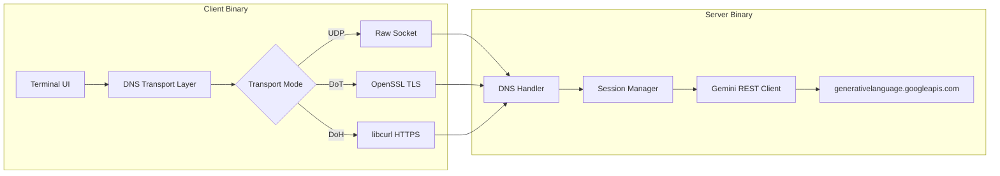

# DNS-CLAW 🦀

**C Language Agentic Wireformat** — A production-grade, pure C port of [DNS-LLM](https://github.com/0Mattias/DNS-LLM).

A complete client-server system that enables secure, agentic interaction with Large Language Models (Gemini) via DNS tunneling. Written from scratch in C11 with zero cloud SDK dependencies — the Gemini REST API is called directly via raw HTTP.



## Features

- **DNS Tunneling**: Custom stateful protocol using Base32-encoded TXT record queries to bypass DNS size limits.
- **Agentic Architecture**: Tool-calling (`client_execute_bash`, `client_read_file`), multi-turn conversation state, and autonomous decision-making — all tunneled through DNS.
- **DNS-over-TLS (DoT)**: Encrypted transport via OpenSSL on port 853.
- **DNS-over-HTTPS (DoH)**: RFC 8484 compliant HTTPS POST transport on port 443.
- **Terminal UI**: Gradient ASCII banner, async spinners, ANSI markdown rendering (headings, code blocks, bold, italic, inline code, lists).
- **Zero SDK Dependencies**: Gemini API called directly via libcurl REST — no Go SDK, no Python, no Node.
- **Portable C11**: Compiles with `-Wall -Wextra -Wpedantic` with zero warnings. No GNU extensions.

## Why C?

This is a port of the original [DNS-LLM](https://github.com/0Mattias/DNS-LLM) (written in Go) to pure C. The motivation:

- **Smaller binaries**: 54K client, 71K server (vs multi-MB Go binaries)
- **No runtime**: No garbage collector, no goroutine scheduler — just raw syscalls and pthreads
- **Full control**: Hand-rolled DNS wire format (RFC 1035), manual TLS, manual HTTP parsing
- **Prove it can be done**: Building a production-grade agentic AI CLI in C with no SDK

## Project Structure

```
├── CMakeLists.txt           # Build system (CMake + Ninja)
├── mise.toml                # Tool version management
├── generate_certs.sh        # Self-signed TLS cert generator
├── .env.example             # Configuration template
├── include/
│   ├── base32.h             # RFC 4648 Base32 (no padding)
│   ├── base64.h             # RFC 4648 Base64 (standard)
│   └── dns_proto.h          # DNS wire format + transports
└── src/
    ├── common/
    │   ├── base32.c          # Base32 encoder/decoder
    │   ├── base64.c          # Base64 encoder/decoder
    │   └── dns_proto.c       # DNS builder/parser + UDP/DoT/DoH
    ├── server/
    │   └── main.c            # Gemini REST client, session mgr, DNS server
    └── client/
        └── main.c            # Terminal UI, spinner, markdown, tool exec
```

## Dependencies

- **C compiler** (clang or gcc)
- **CMake** ≥ 3.14
- **Ninja** (build tool)
- **OpenSSL** (TLS for DoT/DoH)
- **libcurl** (HTTP for DoH client + Gemini API)
- **cJSON** (auto-fetched via CMake FetchContent)

On macOS with [mise](https://mise.jdx.dev/):
```bash
brew install openssl@3 curl
# cmake and ninja are managed by mise.toml
```

## Setup

1. **Clone**
   ```bash
   git clone https://github.com/0Mattias/DNS-CLAW.git
   cd DNS-CLAW
   ```

2. **Configure Environment**
   ```bash
   cp .env.example .env
   # Edit .env → set your GEMINI_API_KEY
   ```

3. **Generate TLS Certificates** (only for DoT/DoH)
   ```bash
   ./generate_certs.sh
   ```

4. **Build**
   ```bash
   mise exec -- cmake -B build -G Ninja -DCMAKE_BUILD_TYPE=Release -DCMAKE_POLICY_VERSION_MINIMUM=3.5
   mise exec -- ninja -C build
   ```
   
   Or without mise:
   ```bash
   cmake -B build -G Ninja -DCMAKE_BUILD_TYPE=Release -DCMAKE_POLICY_VERSION_MINIMUM=3.5
   ninja -C build
   ```

5. **Run**

   Start the server (UDP mode — no sudo needed):
   ```bash
   ./build/server_bin
   ```

   In a separate terminal, start the client:
   ```bash
   ./build/client_bin
   ```

## Transport Modes

| Mode | `.env` Config | Default Port | Sudo? |
|------|--------------|-------------|-------|
| UDP (plain) | `USE_DOT=false`, `USE_DOH=false` | 53535 | No |
| DoT (TLS) | `USE_DOT=true` | 853 | Yes |
| DoH (HTTPS) | `USE_DOH=true` | 443 | Yes |

## Client Commands

| Command | Description |
|---------|-------------|
| `/help` | Show available commands |
| `/clear`, `/new`, `/reset` | Start a new chat session |
| `/compact [focus]` | Ask the LLM to summarize and compact context |
| `/exit`, `/quit` | Exit the application |

## License

This project is licensed under the MIT License — see the [LICENSE](LICENSE) file for details.

## Credits

Port of [DNS-LLM](https://github.com/0Mattias/DNS-LLM) (Go) to C by [@0Mattias](https://github.com/0Mattias).
